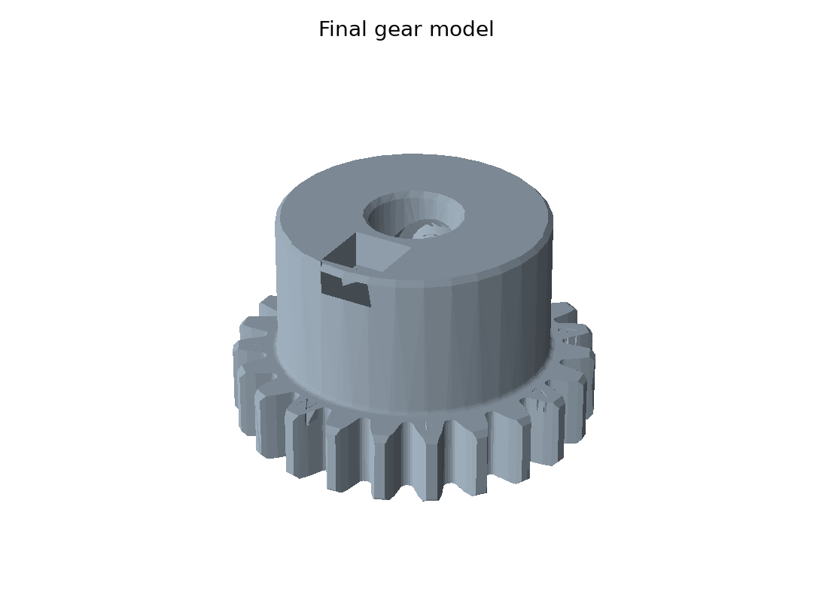

# HACK3D Gear Reconstruction

This is my second HACK3D homework, based on the **2023 Red Vs Blue Gear Reconstruction** challenge.

I found Google Drive links hidden in three images' `XPTitle` metadata. The STL folder's Caesar riddle decodes `Ybsbidbxo` to `Bevelgear`, which unlocks the original gear STL. I used that recovered file as my final model. I also reconstructed an approximate model from the rotated, incomplete CT slices.



## Main files

| File or folder | Contents |
| --- | --- |
| [report.pdf](report.pdf) | My homework report |
| [report.md](report.md) | Editable report text |
| [cad/final_gear.stl](cad/final_gear.stl) | Final model, copied unchanged from the recovered challenge STL |
| [cad/reconstructed_gear.stl](cad/reconstructed_gear.stl) | Approximate model generated from the CT slices |
| `Hack-Gear/` | All 772 supplied images |
| `clues/` | Archives and riddles downloaded from the metadata links |
| `code/` | Recovery, reconstruction, figure, and report scripts |
| `results/` | File inventory, metadata links, and model checks |
| `figures/` | Images used in the report |
| [weekly_update.pdf](weekly_update.pdf) | The new weekly report entry |

The problem statement is also included. These are course homework files; the original dataset and recovered CAD model come from the challenge.

## What I found

- The images rotate by one degree per file in sorted filename order. The correction uses the file's position, not its slice number.
- There are 1,368 missing slice numbers between 103 and 2242. I used the original numbers to preserve height.
- `Ball_rec2161.jpg` points to the folder containing `Original STL.7z` and the Caesar riddle.
- `Ball_rec0338.jpg` and `Ball_rec1139.jpg` contain two other links. I included their downloaded clues, but the original STL route already supplied the required CAD model.
- The recovered model is about **19.94 x 19.98 x 12.00 mm**, with **24 teeth**. Its surfaces are watertight and consistently wound.

STL files do not store units. These coordinates should be interpreted as millimeters. The CT model uses interpolation across missing slices and is only an approximate backup.

## Run the scripts

Use Python 3.12 or a compatible version. From the repository folder:

```bash
python -m venv .venv
source .venv/bin/activate
pip install -r code/requirements.txt
python code/recover_original.py
python code/reconstruct_gear.py
python code/make_figures.py
python code/build_report.py
```

The downloaded archives are included, so the scripts do not need a Google account or network access. The reconstruction reads every supplied image and can take a minute or more, depending on the computer.

## Metadata links

| Image | Link |
| --- | --- |
| `Ball_rec0338.jpg` | [Downloaded Gear_2.7z](https://drive.google.com/file/d/1VLmuUOUWPGbYSqV9WQ3uI23R3-Beu2dt/view?usp=sharing) |
| `Ball_rec1139.jpg` | [Another Mini Challenge](https://drive.google.com/drive/folders/1gmAw-eBU0DDiI67TnQfoI4lgmR8PZ0gl?usp=sharing) |
| `Ball_rec2161.jpg` | [Mini Challenge - original STL](https://drive.google.com/drive/folders/1qPUO9ce7pzeyhAPmZ3cg16hBHD2yFzQ4?usp=sharing) |

The homework is included in my weekly report. I did not use the old competition submission link.
