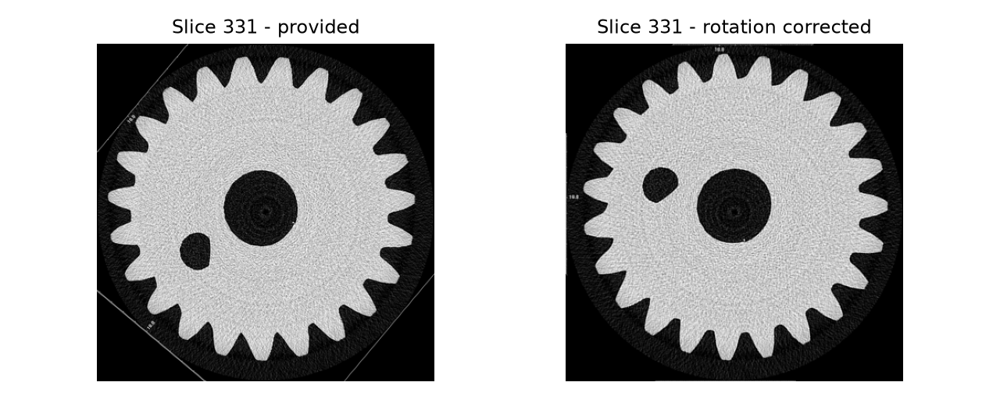
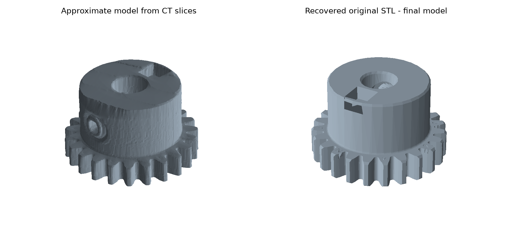

# Gear Reconstruction - Homework 2

Keith Wang | HACK3D | Week of September 30, 2026

## 1. Goal

For this homework, I worked on the 2023 HACK3D Red Vs Blue Gear Reconstruction challenge. My goal was to recover the gear from the supplied files and save a usable CAD model. I used the hidden file metadata to recover the original STL, and I also made an approximate reconstruction from the CT images.

## 2. Checking the dataset

I started by checking the files in Hack-Gear. The folder contains 772 JPEG images, all 4000 by 4000 pixels. The filenames run from Ball_rec0103.jpg to Ball_rec2242.jpg, but many slice numbers are missing. There are 1,368 missing numbers between those endpoints, so simply stacking the images at equal spacing would give the wrong height.

I noticed that the rulers were rotated along with the gear. When I sorted the filenames, the rotation increased by one degree per file. Rotating each image clockwise by its position in the sorted list, starting at zero, lined up the rulers. I checked this on 20 images spread across the dataset.

I also checked the image metadata. Three files had Google Drive links in their XPTitle fields: Ball_rec0338.jpg linked to Downloaded Gear_2.7z, Ball_rec1139.jpg linked to an original SolidWorks archive and a riddle, and Ball_rec2161.jpg linked to an original STL archive and another riddle. I followed the STL link because it could directly provide the required model.

## 3. Recovering the original model

The STL folder contained Original STL.7z and Riddle.txt. The riddle mentioned Caesar and gave the word "Ybsbidbxo." Moving each letter forward by three positions gave "Bevelgear." I used that word as the archive password and successfully extracted Hack gear.STL. I saved an unchanged copy as cad/final_gear.stl. This was the quickest successful route I found, since I did not need to estimate every feature from the incomplete scan.

Figure 1. Slice 331 before and after rotation correction.

<!-- pagebreak -->

## 4. Reconstruction from the CT images

I kept the CT reconstruction as a second result. The visible rulers and Z labels indicate a spacing of about 0.0055 mm per pixel and per original slice number. For example, slice 103 is labeled Z = 0.566 mm. I reduced each image to 400 by 400 pixels, corrected its rotation, smoothed the noise slightly, and separated the bright gear material from the darker background using a threshold of 110.

I kept the main connected region in each image and filled only very small dark spots. I used the original slice numbers for the Z positions and interpolated across the missing ranges. Finally, I used marching cubes to turn the stacked slices into an STL surface. The output grid spacing was 0.055 mm. I counted 24 teeth in a complete lower slice and estimated an outside diameter of about 19.9 mm and a central bore of about 4.9 mm.

This model preserves the main gear, hub, bore, and larger openings. Its surface is rougher than the recovered original model. The missing sections are estimates, and I capped the lower face at the first supplied slice. I would use the recovered original STL for the final homework result.

Figure 2. The approximate CT reconstruction and the recovered original model.

## 5. Result

The final recovered model measures approximately 19.94 by 19.98 by 12.00 mm. It contains 12,654 triangles. I checked that its surfaces are closed and that the triangle winding is consistent. The original file contains eight closed shells, including internal features, so I kept them instead of removing them. The approximate CT model is also watertight and consists of one connected component.

I saved the final model, CT model, scripts, figures, downloaded clues, and file inventory together. The main result is cad/final_gear.stl. The detailed check results are in the results folder. I have not printed or physically tested the gear.
